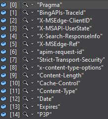

# AzureBingImageSearchVersion7.0👏

### 参考文献
https://docs.microsoft.com/ja-jp/azure/cognitive-services/bing-image-search/quickstarts/csharp

### コマンドライン引数
| オプション名 | 概要 | 
| --- | --- |
| --key, -k | APIキー | 
| --dir, -d | 保存先ディレクトリ | 
| --term, -t | 検索ワード | 

example → --key abcdefg1234567 --dir C:/Dataset --term Bird

### ResponseHeaders

